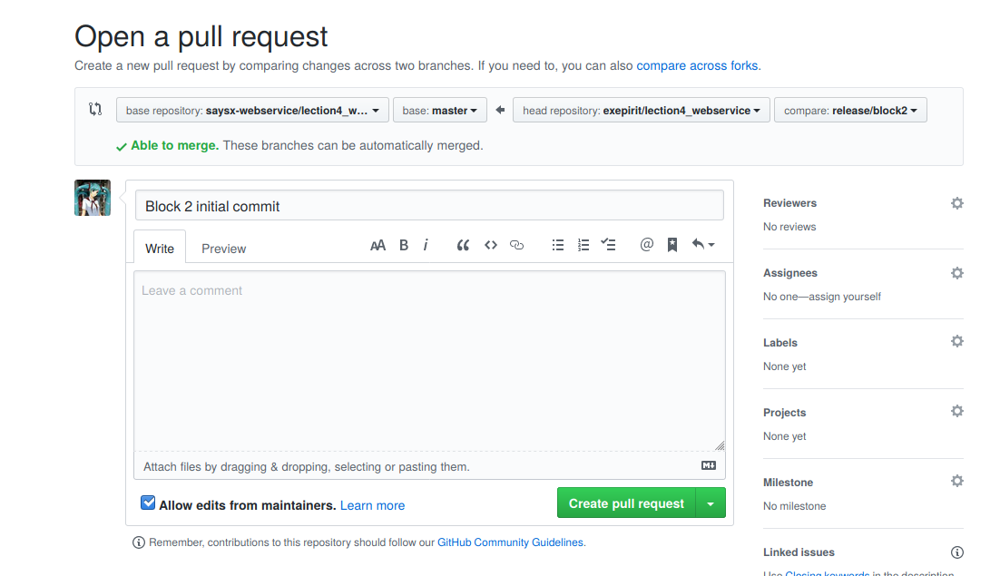
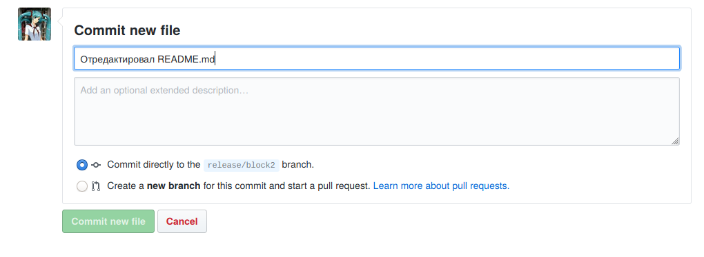

# Работа с репозиторием

Работа производится в ветках `release/block1`, `release/block2`, `release/block3`
в зависимости от номера группы.

Каждый Pull Request должен в названии содержать фамимлию и имя автора, краткое описание изменений (например "Добавление слайда о кошках"), описание опционально.

## Общий алгоритм

1. Форкнуть основной репозиторий [saysx-webservice/lection4_webservice](https://github.com/saysx-webservice/lection4_webservice);
2. Склонировать получившийся репозиторий на свой компьютер. Список Ваших репозиториев всегда можно посмотреть в списке слева на [главной странице](https://github.com/);
3. Переключиться на требуемую ветку (`release/block1`, `release/block2`, `release/block3`);
4. Продолжить работу в локальном репозитории;
5. Создать pull request для слияния в основной репозиторий. Для этого нужно на странице Вашего репозитория нажать на кнопку *New pull request*, убедиться что в base repository выставлен `saysx-webservice/lection4_webservice`, а в head repository Ваш форк. Также необходимо убедиться что высталены требуемые ветви. Снизу должен появиться список изменений и кнопка *Create pull request*, далее заполняем необходимые данные и снова жмем на *Create pull request*.

### Упрощенная процедура создания Pull Request

1. Переходим на страницу [основного репозитория](https://github.com/saysx-webservice/lection4_webservice);
2. В верхней части должен появиться желтый блок с указанием вашего форка и кнопкой *Compare & pull request*;
   
3. Нажать на *Compare & pull request*;
4. Выбрать верные compare и base ветви (например `release/block1` и `release/block1`);
   

Далее Pull Request создается как обычно.

## Редактирование

Редактировать исходный код можно двумя способами:

### GitHub Web GUI

На странице форка нужно выбрать требуемую ветку. Справа есть кнопки для создания файла, на странице каждого файла есть кнопка для редактирования.

После редактирования файла или набора файлов необходимо сделать commit, т.е. сохранить файл. Для этого внизу страницы есть форма для описания изменений и создания коммита.

## В клиенте Git и текстовом редакторе на компьютере разработчика

Для этого используются клиенты Git и тестовые редакторы, либо полноценные IDE. Для отдельных клиентов необходмо самостоятельно найти информацию о процедурах: клонирования репозитория, переключения ветви, 
созданию коммита, push изменений.

## Клиенты Git

* все современные IDE имеют встроенную поддержку репозиториев git;
* в [Visual Studio Code](https://code.visualstudio.com/) при предустановленном Git CLI;
* [Git CLI](https://git-scm.com/downloads);
* [SourceTree](https://www.sourcetreeapp.com/);
* [Sublime Merge](https://www.sublimemerge.com/).

### Git CLI

Краткий список команд для Git CLI:
* `git clone https://github.com/username/lection4_webservice` - клонирование репозитория `username/lection4_webservice` в локальный репозиторий;
* `git checkout release/block1` - переключение локального репозитория на ветку `release/block1`;
* `git status` - просмотр текущих изменений;
* `git add README.md` - добавление файла `README.md` в индекс, т.е. отметка файла как измененного;
* `git commit -m "Edit README.md"` - фиксация ожидающих изменений с комментарием "Edit README.md";
* `git push` - отправка зафиксированных изменений из локального репозитория в удаленный;
* `git pull` - получение изменений с удаленного репозитория.

## Полезные ссылки

[Курс «Git для начинающих»](https://tproger.ru/video/git-for-beginners-3/). Краткие видео о базовых возможностях Git.  
[Git за полчаса: руководство для начинающих](https://proglib.io/p/git-for-half-an-hour)  
[[EN] Markdown Cheatsheet](https://github.com/adam-p/markdown-here/wiki/Markdown-Cheatsheet)  
[[RU] Markdown Cheatsheet](https://github.com/sandino/Markdown-Cheatsheet)  